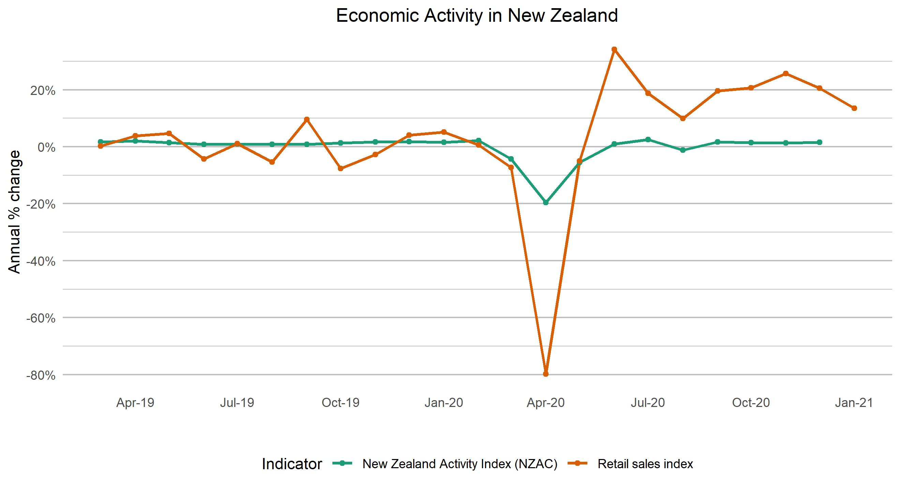

## Data Cleaning and Choosing
I changed the _class_, _category_, and _indicator_name_ columns into factor type, since these are categorical variables. I changed the _date_last_updated_ variable into Date type, since this had consistent (date) formatting.
For each section, I extracted the relevant information using the indicator (or sub-series) names. I then removed unnecessary columns, renamed the remaining columns to be more informative, and converted the dates column into Date type (using the relevant format).
For the overall wellbeing section, I expanded one of the columns into three columns (long to wide format), as this made intuitive sense and helped to plot the confidence bands.

I chose data that seemed relatively objective and included information from before the COVID-19 NZ response began, so that I could compare before and after to generate insights into changes due to COVID-19. The overall wellbeing data was chosen to get a direct/explicit indicator of the wellbeing of New Zealanders.

## Economic activity

COVID-19 has caused major disruption to all New Zealander households and firms, which has caused a change in the types of goods and services demanded and supplied. 
The figure below shows the significant decrease in the annual change of economy activity during the first lockdown in April 2020. There is also a dip in annual % change during the second lockdown in August 2020. Other than these lockdowns, the change in economic activity has been positive. The retail sales index shows that the post-lockdown retail activity has balanced out the lack of retail activity during the lockdowns.

```{r activity, out.width="75%", fig.align="center", echo=FALSE}

```

## Unemployment

The global recession cause by COVID-19 has led to a increase of unemployment in the New Zealand labour market. A key measure of unemployment is the number of people on the jobseeker support, which provides financial support to unemployed individuals who are actively searching and applying for jobs. All ethnicities experienced an increase in the number of people on jobseeker support, but the increase was larger for some ethnicities.

The NZ Europeans showed the largest increase in the number on jobseeker support, with a very sharp rise in April 2020 and little change since. The Māori population show a steadier increase in jobseeker support which looks like it could continue to grow into 2021.
However, the percentage of the jobseeker population that is Māori actually decreased during April 2020 from about 40% to 30%. The increase of the percentage on jobseeker that are NZ European (from high-30% to mid-40%) has now been reverted back to about the same level in June 2019.
Regardless of COVID-19, it is concerning that Māori significantly outnumber NZ Europeans in jobseeker support, since they make up only 16.5% of the New Zealand population, compared to 70.2% for NZ Europeans (Stats NZ 2018 census).

```{r jobseeker, fig.align="center", out.width="85%", echo=FALSE}

```


## Overall wellbeing

During the escalated alert levels in 2020, the Ministry of Health surveyed New Zealand residents about their overall wellbeing compared to non-alert level times. At the start of the first lockdown, one in four respondants said their overall wellbeing was worse than usual, and this dropped to about one in twenty by late June, before resurging to almost one in five during the second lockdown in August.
This shows that a significant number of New Zealanders felt that the COVID-19 restrictions had a negative impact on their overall wellbeing.

```{r overall wellbeing, fig.align="center", out.width="75%", echo=FALSE}

```
